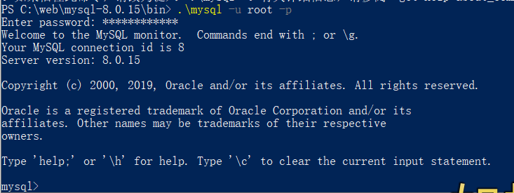
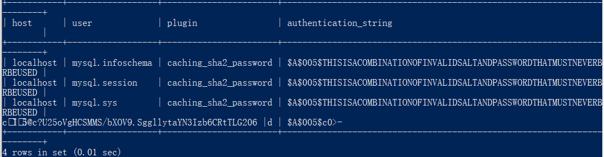
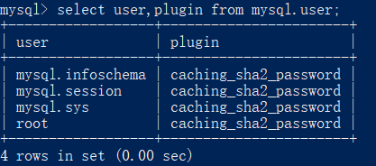
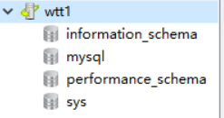

# MySQL 软件安装及数据库基础

## 1.软件安装及服务器设置

参考资料：http://www.runoob.com/mysql/mysql-install.html

在https://dev.mysql.com/downloads/mysql/网页中下载mysql-8.0.15-winx64.zip

将解压后的文件放置在 **C:\web\mysql-8.0.11**并在文件夹下创建 **my.ini** 配置文件，编辑 **my.ini** 配置以下基本信息：

```
[mysql]
# 设置mysql客户端默认字符集
default-character-set=utf8
 
[mysqld]
# 设置3306端口
port = 3306
# 设置mysql的安装目录
basedir=C:\\web\\mysql-8.0.15
#修改目录
# 设置 mysql数据库的数据的存放目录，MySQL 8+ 不需要以下配置，系统自己生成即可，否则有可能报错
# datadir=C:\\web\\sqldata
# 允许最大连接数
max_connections=20
# 服务端使用的字符集默认为8比特编码的latin1字符集
character-set-server=utf8
# 创建新表时将使用的默认存储引擎
default-storage-engine=INNODB
```

以管理员身份打开 cmd 命令行工具（只能用cmd不能用powershell...emmm），切换目录：

```
cd C:\web\mysql-8.0.11\bin
```

初始化数据库：

```
mysqld --initialize --console
```

输出配置信息：

2019-02-25T14:48:51.020744Z 5 [Note] [MY-010454] [Server] A temporary password is generated for root@localhost: Z0m%lj32jt8q

**密码Z0m%lj32jt8q**

**注：必须加管理员权限，powershell必须加.\mysqld.exe 运行**

**登录：**

命令：mysql -h 主机名 -u 用户名 -p

参数说明：

- **-h** : 指定客户端所要登录的 MySQL 主机名, 登录本机(localhost 或 127.0.0.1)该参数可以省略;
- **-u** : 登录的用户名;
- **-p** : 告诉服务器将会使用一个密码来登录, 如果所要登录的用户名密码为空, 可以忽略此选项。

登录本机：mysql -u root -p



 使用图形界面软件 Navicat for SQL

## 2.使用图形界面软件 Navicat for SQL

星球提供破解版Navicat for SQL
简易步骤:
解压缩文件，复制key
打开文件夹中的navicat.exe
用户名随意，输入key，然后连接数据库
输入密码，连接名改成自己喜欢的
剩下的自己探索，怎么在navicat中创建数据库、表等等

密码有强制过期问题

设置密码永不过期，my.cnf配置如下：

```
[mysqld]
default_password_lifetime=0
```

会将密码过期功能禁用，命令如下：

```
ALTER USER 'testuser'@'localhost' PASSWORD EXPIRE NEVER;
```

在登陆之后修改密码 ALTER USER USER() IDENTIFIED BY *''wttree123;*

新密码 wttree123

**1251 client does not support ..问题**

```html
select host,user,plugin,authentication_string from mysql.user;
```



修改密码权限



更新user为root，host为% 的密码为 mysql

ALTER USER 'root'@'%' IDENTIFIED WITH mysql_native_password BY 'mysql';

更新user为root，host为localhost 的密码为mysql

ALTER USER 'root'@'localhost' IDENTIFIED WITH mysql_native_password BY 'mysql;

链接成功：



## 3.数据库基础知识
### 数据库定义

数据库这个术语的用法很多，但就本书而言（从 SQL的角度来看），数据库是一个以某种有组织的方式存储的数据集合。最简单的办法是将数据库想象为一个文件柜。这个文件柜是一个存放数据的物理位置，不管数据是什么，也不管数据是如何组织的。
**数据库（database**
保存有组织的数据的容器（通常是一个文件或一组文件）。
注意：误用导致混淆
人们通常用数据库这个术语来代表他们使用的数据库软件，这是不正
确的，也因此产生了许多混淆。确切地说，**数据库软件应称为数据库
管理系统（DBMS）**。数据库是通过 DBMS创建和操纵的容器，而具
体它究竟是什么，形式如何，各种数据库都不一样。

### 关系型数据库

关系型数据库：指采用了关系模型来组织数据的数据库。关系模型指的就是二维表格模型，而一个关系型数据库就是由二维表及其之间的联系所组成的一个数据组织。

### 基本概念

* 表（table）某种特定类型数据的结构化清单。

  表具有一些特性，这些特性定义了数据在表中如何存储，包含存储什么
  样的数据，数据如何分解，各部分信息如何命名等信息。描述表的这组
  信息就是所谓的模式（schema），模式可以用来描述数据库中特定的表，
  也可以用来描述整个数据库（和其中表的关系）。

* 二维表：在[关系模型](https://baike.baidu.com/item/%E5%85%B3%E7%B3%BB%E6%A8%A1%E5%9E%8B)中，数据结构表示为一个二维表，一个关系就是一个二维表（但不是任意一个二维表都能表示一个关系），二维表名就是关系名。表中的第一行通常称为属性名，表中的每一个[元组](https://baike.baidu.com/item/%E5%85%83%E7%BB%84)和属性都是不可再分的，且元组的次序是无关紧要的。
* 行：表中的一个记录。
  列：表中的一个字段。所有表都是由一个或多个列组成的。
  主键：一列（或一组列），其值能够唯一标识表中每一行。
  外键：如果[公共关键字](https://baike.baidu.com/item/%E5%85%AC%E5%85%B1%E5%85%B3%E9%94%AE%E5%AD%97)在一个关系中是[主关键字](https://baike.baidu.com/item/%E4%B8%BB%E5%85%B3%E9%94%AE%E5%AD%97/1239455)，那么这个公共关键字被称为另一个关系的外键。

## 4.MySQL数据库管理系统

MySQL 是最流行的关系型数据库管理系统，在 WEB 应用方面 MySQL 是最好RDBMS(Relational Database Management System：关系数据库管理系统)应用软件之一

数据库： 数据库是一些关联表的集合。
数据表：表是数据的矩阵。在一个数据库中的表看起来像一个简单的电子表格。
视图：视图是对若干张基本表的引用，一张虚表，查询语句执行的结果，不存储具体的数据（基本表数据发生了改变，视图也会跟着改变）
存储过程：sql语句需要先编译然后执行，而存储过程时一组为了完成特定功能的sql语句集，经编译存储在数据库中，用户通过执行存储过程的名字并给定参数，来调用执行它

存储过程是可编程的函数，在数据库中创建并保存，可以有sql语句和控制结构组成，当想要在不同的应用程序或者平台上执行相同的函数，或者封装特定功能时，存储或称是十分有用的，数据库的村粗过程可以看作是编程中面向对象方法的模拟，它允许控制数据的访问方式。

关闭mysql服务器：

net stop mysql