# MySQL 基础 （一）- 查询语句

## 学习内容

### 1.导入示例数据库

教程 [MySQL导入示例数据库 -		MySQL教程™](https://www.yiibai.com/mysql/how-to-load-sample-database-into-mysql-database-server.html)

MySQL示例数据库结构

MySQL示例数据库模式由以下表组成：

- `customers`: 存储客户的数据。
- `products`: 存储汽车的数据。
- `productLines`: 存储产品类别数据。
- `orders`: 存储客户订购的销售订单。
- `orderDetails`: 存储每个销售订单的订单产品数据项。
- `payments`: 存储客户订单的付款数据信息。
- `employees`: 存储所有员工信息以及组织结构，例如，直接上级(谁向谁报告工作)。
- `offices`: 存储销售处数据，类似于各个分公司。


连接到MySQL服务器并创建数据库

```shell
mysql -hlocalhost -uroot -p
E
```

创建数据库

```shell
CREATE DATABASE IF NOT EXISTS yiibaidb DEFAULT CHARSET utf8 COLLATE utf8_general_ci;
```

导入数据

```shell
use yiibaidb;
mysql> source D:/worksp/yiibaidb.sql;
```

 测试导入结果

```shell
select city,phone,country from offices;
#在数据库名称上不需要加''
```

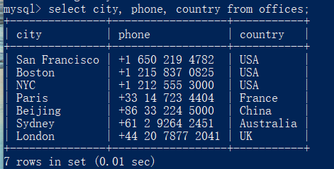

### 2. SQL是什么？MySQL是什么？

SQL是一种用于操作数据库的语言。SQL是用于所有数据库的基本语言。不同数据库之间存在较小的语法更改，但基本的SQL语法基本保持不变。SQL是**S** tructured **Q** uery **L**anguage 的简短缩写。根据ANSI（美国国家标准协会），SQL是操作关系数据库管理系统的标准语言。

SQL用于访问，更新和操作数据库中的数据。它的设计允许管理RDBMS中的数据，例如MYSQL。SQL语言还用于控制数据访问以及数据库模式的创建和修改。

MySQL是在90年代中期开发的，是市场上第一个可用的开源数据库之一。今天有很多MySQL的替代变种。但是，变体之间的差异并不重要，因为它们使用相同的语法，并且基本功能也保持不变。

MySQL是一种RDBMS，它允许保持数据库中存在的数据。MySQL的发音为“我的SQL”，但它也被称为“我的续集”。它以联合创始人Michael Widenius的女儿的名字命名。MySQL提供对数据库的多用户访问。在Linux发行版之上，此RDBMS系统与PHP和Apache Web Server的组合一起使用。MySQL使用SQL语言来查询数据库

对比：

SQL是一种用于操作数据库的语言

MySQL是市场上第一个可用的开源数据库之一

SQL用于访问，更新和操作数据库中的数据

MySQL是一种RDBMS，它允许保持数据库中存在的数据

SQL是结构化查询语言

MySQL是一个使用MYSQL存储，检索，修改和管理数据库的RDBMS

SQL是一种查询语言，而MYSQL是数据库软件

### 3. 查询语句 SELECT FROM 

**net start mysql ** 启动数据库

语句解释：SELECT语句用途是从一个或多个表中检索信息

关键字（keyword）
作为 SQL组成部分的保留字。关键字不能用作表或列的名字。附录 E
列出了某些经常使用的保留字。

```
SELECT prod_name FROM Products
SELECT * FROM Products
```


**利用 SELECT语句从 Products表中检索一个名为 prod_name的列**

利用*为通配符

SQL关键字使用大写，而对列名和表名使用小写，这样做使代码更易于阅读和调试。

去重语句：对于每一行不需要每一个词都出现，在关键词前加上DISTINCT去重

```
 SELECT country FROM offices;
 SELECT DISTINCR country FROM offices;
```

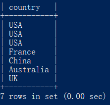

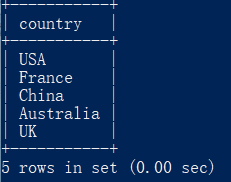

前N个语句：MySQL查询前N条语句：

```
SELECT country from offices limit 0,3
```

CASE...END判断语句：用于条件控制

简单的搜索检查并生成一个新的列，可以是相当于类别属性

```
SELECT city, phone, country, case country
    -> when 'USA' then '0'
    -> when 'China' then '1'
    -> else '3'
    -> end as country_id
    -> from offices;
```


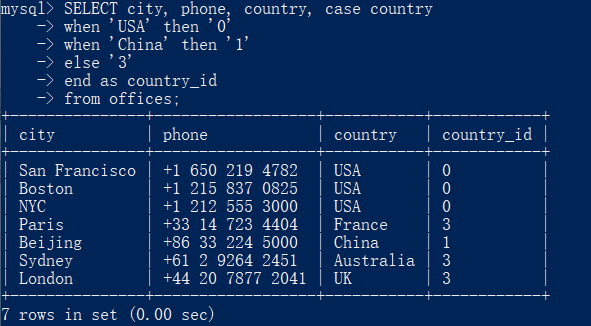

### 4. 筛选语句 WHERE 

语句解释：

```
SELECT field1, field2,...fieldN FROM table_name1, table_name2...
[WHERE condition1 [AND [OR]] condition2.....
```

[WHERE condition1 [AND [OR]] condition2..... 相当于通过键值进行

```
SELECT * FROM offices WHERE country = 'China';
```

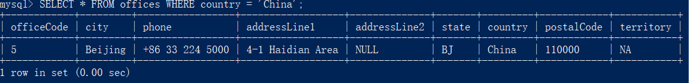

运算符 and or not

通配符 *

操作符

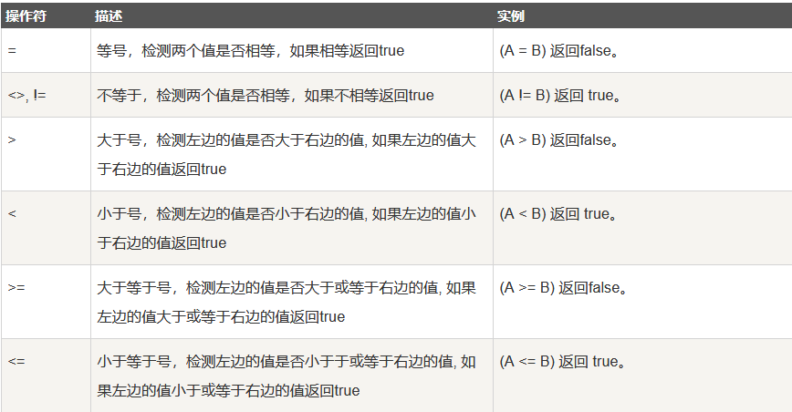

### 5. 分组语句 GROUP BY

聚集函数：用于分组的function

语句解释语句根据一个或多个列对结果集进行分组。

```mysql
SELECT column_name, function(column_name) # 使用 COUNT, SUM, AVG,等函数。
FROM table_name
WHERE column_name operator value
GROUP BY column_name;
```

```mysql
SELECT country, COUNT(*) FROM offices GROUP BY country;
```

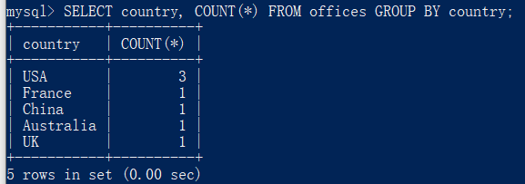

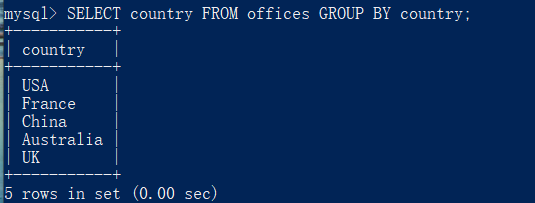

WHERE子句：分组查询可以在形成组和计算列函数之前具有消除非限定行的标准where子句。必须在group by子句之前指定where子句

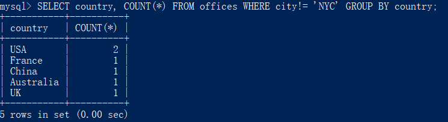

在统计前消除某些数据

**注：在SELECT语句中指定的每个列名也在GROUP BY子句中提到，未在这两个地方提到的列名将产生错误。GROUP BY子句对dept和edlevel的每个唯一组合各返回一行。**

例如

```mysql
SELECT country,city FROM offices GROUP BY country;
```

报错 

HAVING子句：**GROUP BY子句之后使用Having子句**

GROUP BY子句后面包含了一个HAVING子句。HAVING类似于WHERE（唯一的差别是WHERE过滤行，HAVING过滤组）AVING支持所有WHERE操作符。

```mysql
SELECT country,count(*) FROM offices GROUP BY country HAVING count(*)>2;
```


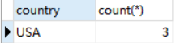

### 6.排序语句 ORDER BY 
语句解释

```mysql
SELECT field1, field2,...fieldN table_name1, table_name2...
ORDER BY field1, [field2...] [ASC [DESC]]
```

- 你可以使用任何字段来作为排序的条件，从而返回排序后的查询结果。
- 你可以设定多个字段来排序。
- 你可以使用 ASC 或 DESC 关键字来设置查询结果是按升序或降序排列。 默认情况下，它是按升序排列。
- 你可以添加 WHERE...LIKE 子句来设置条件。

正序、逆序

正序

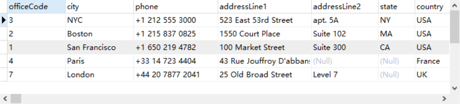


逆序

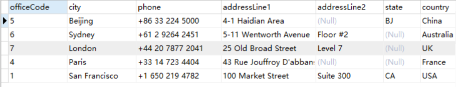

### 7. 函数
时间函数：用于时间或者日期计算的函数

```
SELECT ADDDATE("2019-03-01",INTERVAL 10 DAY)
```

数值函数：绝对值，三角函数、等

```
SELECT ABS(-1)
```

字符串函数：大小写切换、ascci码转换

```
SELECT ASCII(city) FROM offices;
```

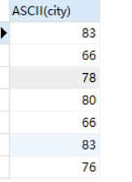

### 8. SQL注释

```mysql
SELECT ASCII(city) FROM offices; --单行注释
/*多行注释
测试1
测试2
*/
```


### 9. SQL代码规范

**命名的建议**

- 使用统一的、描述性强的字段命名规则
- 保证字段名是独一无二且不是保留字的，不要使用连续的下划线，不用下划线结尾
- 最好以字母开头

id 标识符——user_id 用户标识 item_id 商品标识
dt 表示某个事件发生的时间——ord_dt 订单时间 exam_dt 考试时间
num 表示某事相关的数字——sale_num 销量
name 用字母表示名称——stu_name 学生名 等

总结id标识、dt时间、num数量、name名称

**格式建议**

最好使用标准SQL函数而不是特定供应商Oracle、Mysql等的函数以提高可移植性

大小写的运用，系统关键字大写，字段表名小写

灵活使用空格和缩进来增强可读性——两大法宝空白隔道与垂直间距

```mysql
select name,id,sex
from (select *
from school_score
where class_cd=110)
where sex = 'man'
and exam_dt = '2016-06-01';

--空白隔道+垂直间距+大小写+缩进
SELECT name, id, sex
 FROM (SELECT *
          FROM school_score
         WHERE class_cd = 110)
 WHERE sex = 'man'
   AND exam_dt = '2016-06-01';
```

1. 利用空格保持关键字对齐
2. 在等号前后（=）在逗号后（,）单引号前后（'）加上空格
3. 子查询缩进并对齐

**语法建议**

- 尽量使用BETWEEN而不是多个AND
- 同样，使用 IN 而不是多个OR
- 利用CASE语句嵌套处理更复杂的逻辑结构
- 避免UNION语句与临时表

```mysql
SELECT CASE postcode
       WHEN 'BN1' THEN 'Brighton'
       WHEN 'EH1' THEN 'Edinburgh'
       END AS city
  FROM office_locations
 WHERE country = 'United Kingdom'
   AND opening_time BETWEEN 8 AND 9
   AND postcode IN ('EH1', 'BN1', 'NN1', 'KW1');
```

### sql格式优化工具

**SQLinForm（SQL Formatter for Professionals - Also Free Online SQL Beautifiers & Plugins available）**http://www.sqlinform.com/

## 作业

### 项目一：查找重复的电子邮箱（难度：简单）
创建 email表，并插入如下三行数据
+----+---------+
| Id | Email   |
+----+---------+
| 1  | a@b.com |
| 2  | c@d.com |
| 3  | a@b.com |
+----+---------+

编写一个 SQL 查询，查找 email 表中所有重复的电子邮箱。
根据以上输入，你的查询应返回以下结果：
+---------+
| Email   |
+---------+
| a@b.com |
+---------+
说明：所有电子邮箱都是小写字母。

**创建数据表**

```mysql
CREATE TABLE table_name (column_name column_type);
```

示例

```mysql
CREATE TABLE IF NOT EXISTS `runoob_tbl`( --判定是否存在
   `runoob_id` INT UNSIGNED AUTO_INCREMENT, -- INT UNSIGNED数据类型 、AUTO_INCTRMENT设为自增属性
   `runoob_title` VARCHAR(100) NOT NULL, --限制字段不为空
   `runoob_author` VARCHAR(40) NOT NULL,
   `submission_date` DATE,
   PRIMARY KEY ( `runoob_id` ) --设定主键
)ENGINE=InnoDB DEFAULT CHARSET=utf8; --ENGINE 设置存储引擎，CHARSET 设置编码。
```

创建所需要的email数据库

```mysql
CREATE TABLE Email(
	id INT UNSIGNED AUTO_INCREMENT,
	Email VARCHAR(100) NOT NULL,
	PRIMARY KEY(id)
)ENGINE=InnoDB DEFAULT CHARSET=utf8;
```

**插入数据**

```mysql
INSERT INTO table_name ( field1, field2,...fieldN ) --列名
                       VALUES
                       ( value1, value2,...valueN );-- 值
```

插入所需要的数据

```mysql
INSERT INTO email (Email)
				  VALUES
				  ('a@b.com');
```

实现表格建立和数据插入

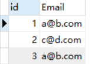

**查找 email 表中所有重复的电子邮箱。**

```MYSQL
SELECT Email FROM email GROUP BY Email HAVING COUNT(*)>1
```

实现结果

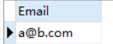

### 项目二：查找大国（难度：简单）
创建如下 World 表
+-----------------+------------+------------+--------------+---------------+
| name            | continent  | area       | population   | gdp           |
+-----------------+------------+------------+--------------+---------------+
| Afghanistan     | Asia       | 652230     | 25500100     | 20343000      |
| Albania         | Europe     | 28748      | 2831741      | 12960000      |
| Algeria         | Africa     | 2381741    | 37100000     | 188681000     |
| Andorra         | Europe     | 468        | 78115        | 3712000       |
| Angola          | Africa     | 1246700    | 20609294     | 100990000     |
+-----------------+------------+------------+--------------+---------------+
如果一个国家的面积超过300万平方公里，或者(人口超过2500万并且gdp超过2000万)，那么这个国家就是大国家。
编写一个SQL查询，输出表中所有大国家的名称、人口和面积。
例如，根据上表，我们应该输出:
+--------------+-------------+--------------+
| name         | population  | area         |
+--------------+-------------+--------------+
| Afghanistan  | 25500100    | 652230       |
| Algeria      | 37100000    | 2381741      |
+--------------+-------------+--------------+

创建空表

```mysql
CREATE TABLE World (
	name VARCHAR(100) NOT NULL,
	continent VARCHAR(100) NOT NULL,
	area INT UNSIGNED,
	popnlation INT UNSIGNED,
	gdp int UNSIGNED
	
)ENGINE=InnoDB DEFAULT CHARSET=utf8;
```

设置主键

```mysql
ALTER TABLE world ADD PRIMARY KEY(name)
```

插入数据

**注：命名/修改/调用列名或者表名的时候，不用在属性上加'' ；但是在表里的内容信息，具体的就得加上''**

````mysql
INSERT INTO WORLD (name, continent, area, population, gdp)
									 VALUES
									 ('Afghanistan', 'Asia', 652230, 25500100, 20343000);
````

得出表格：

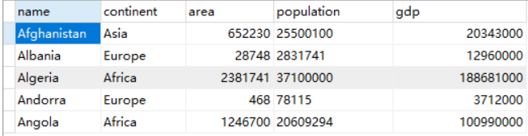

输出表中所有大国家的名称、人口和面积

```mysql
SELECT name, population, area
	FROM world
	WHERE area >3000000 OR (population > 25000000 and gdp > 20000000) ;
```

**注：一些顺序问题：SELECT / FROM /WHERE (LIMIT /OFFSET)/GROUP BY/ HAVING **

