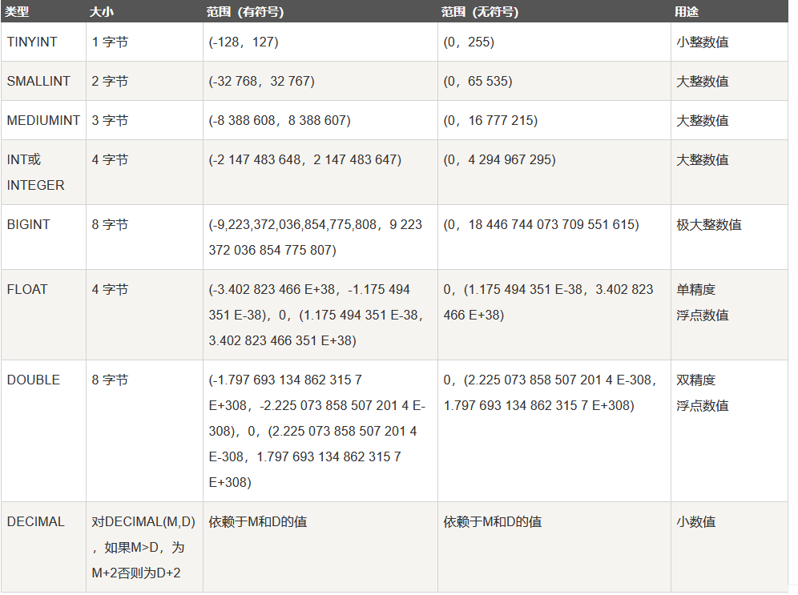
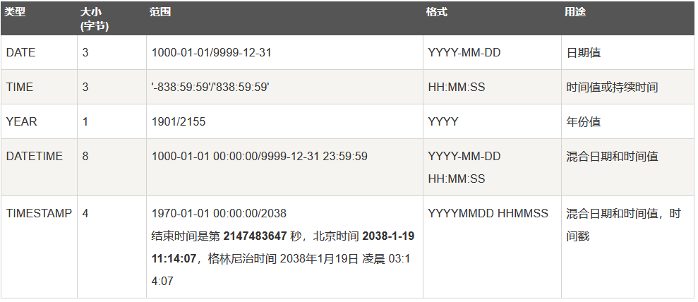
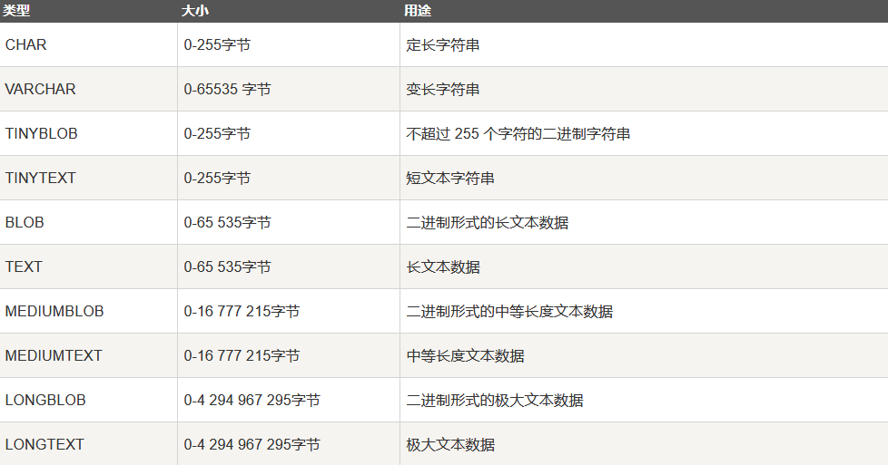

# MySQL 基础 （二）- 表操作

## 学习内容

### 1. MySQL表数据类型

**在上次学习中可用于创建表格中的数据类型的定义**

MySQL中定义数据字段的类型对你数据库的优化是非常重要的。

MySQL支持多种类型，大致可以分为三类：**数值、日期/时间和字符串(字符)类型**。

**数值类型**



**日期和时间类型**

每个时间类型有一个有效值范围和一个"零"值，当指定不合法的MySQL不能表示的值时使用"零"值。



**字符串类型**



### 2. 用SQL语句创建表

语句解释

```mysql
CREATE TABLE table_name (column_name column_type);
```

table_name:表名

column_name column_type：列名、数据类型（如果有多个列名以，隔开）

设定列类型 、大小、约束

```mysql
CREATE TABLE IF NOT EXISTS `runoob_tbl`(
   `runoob_id` INT UNSIGNED AUTO_INCREMENT, --无符号整型
   `runoob_title` VARCHAR(100) NOT NULL,
   `runoob_author` VARCHAR(40) NOT NULL,
   `submission_date` DATE,
   PRIMARY KEY ( `runoob_id` )
)ENGINE=InnoDB DEFAULT CHARSET=utf8;
```

- 如果你不想字段为 **NULL** 可以设置字段的属性为 **NOT NULL**， 在操作数据库时如果输入该字段的数据为**NULL** ，就会报错。
- AUTO_INCREMENT定义列为自增的属性，一般用于主键，数值会自动加1。
- PRIMARY KEY关键字用于定义列为主键。 您可以使用多列来定义主键，列间以逗号分隔。
- ENGINE 设置存储引擎，CHARSET 设置编码。

设定主键

在创建表格时使用

```mysql
PRIMARY KEY ( `runoob_id` )
```

设定主键，在列名设定的最后一行

后来添加设定主键

```mysql
ALTER TABLE world ADD PRIMARY KEY(name)
```

### 3. 用SQL语句向表中添加数据

语句解释

一次添加一条数据

```mysql
INSERT INTO table_name ( field1, field2,...fieldN ) -- table_name表名；field1, field2,...fieldN列名
                       VALUES
                       ( value1, value2,...valueN );-- value1, value2,...valueN对应值
```

INSERT 插入多条数据

```mysql
INSERT INTO table_name  (field1, field2,...fieldN)  VALUES  (valueA1,valueA2,...valueAN),(valueB1,valueB2,...valueBN),(valueC1,valueC2,...valueCN)......;
```

多种添加方式（指定列名；不指定列名）

**不指定列名**

```mysql
 INSERT INTO runoob_tbl
    -> VALUES
    -> (0, "JAVA 教程", "RUNOOB.COM", '2016-05-06');
```

第一列如果没有设置主键自增（PRINARY KEY AUTO_INCREMENT）的话添加第一列数据比较容易错乱，要不断的查询表看数据。

如果添加过主键自增（PRINARY KEY AUTO_INCREMENT）第一列在增加数据的时候，可以写为0或者null，这样添加数据可以自增， 从而可以添加全部数据，而不用特意规定那几列添加数据。

### 4. 用SQL语句删除表

语句解释

```mysql
DROP TABLE table_name ;
```

DELETE:删除表内数据（设定条件删除数据）

```mysql
delete from 表名 where 删除条件;
delete from  student where  T_name = "张三";
```

DROP:删除完整表格（完整删除）
TRUNCATE:清除表内数据，保存表结构（清空数据）

```mysql
truncate table 表名;
truncate  table  student;
```

不同方式的区别

1. 当你不再需要该表时， 用 **drop**;

2. 当你仍要保留该表，但要删除所有记录时， 用 **truncate**;

3. 当你要删除部分记录时， 用 **delete**

1、**drop table table_name** : 删除表全部数据和表结构，立刻释放磁盘空间，不管是 Innodb 和 MyISAM;

实例，删除学生表：

```
drop table student;
```

2、**truncate table table_name** : 删除表全部数据，保留表结构，立刻释放磁盘空间 ，不管是 Innodb 和 MyISAM;

实例，删除学生表：

```mysql
truncate table student;
```

3、**delete from table_name** : 删除表全部数据，表结构不变，对于 MyISAM 会立刻释放磁盘空间，InnoDB 不会释放磁盘空间;

实例，删除学生表：

```mysql
delete from student;
```

4、**delete from table_name where xxx** : 带条件的删除，表结构不变，不管是 innodb 还是 MyISAM 都不会释放磁盘空间;

实例，删除学生表中姓名为 "张三" 的数据：

```mysql
delete from student where T_name = "张三";
```

5、delete 操作以后，使用 **optimize table table_name** 会立刻释放磁盘空间，不管是 innodb 还是 myisam;

实例，删除学生表中姓名为 "张三" 的数据：

```mysql
delete from student where T_name = "张三";
```

实例，释放学生表的表空间：

```mysql
optimize table student;
```

6、**delete from** 表以后虽然未释放磁盘空间，但是下次插入数据的时候，仍然可以使用这部分空间。

### 6.用SQL语句修改表

修改列名

```mysql
ALTER TABLE email CHANGE COLUMN Email EMAIL VARCHAR(100)
```

修改表中数据:UPDATE 命令修改 MySQL 数据表数据

```mysql
UPDATE table_name SET field1=new-value1, field2=new-value2
[WHERE Clause]
UPDATE email SET EMAIL = '213edsd' WHERE id = 1
```

删除行

```mysql
delete from student where T_name = "张三";
```

删除列

```mysql
alter table 表名 drop column 字段名
ALTER TABLE email DROP COLUMN name 
```

新建列

```mysql
alter table 表名  add  字段名  字段的类型
ALTER TABLE email ADD name VARCHAR(100)
```

新建行

```mysql
INSERT INTO table_name ( field1, field2,...fieldN )
                       VALUES
                       ( value1, value2,...valueN );
```

## 作业

### 项目三：超过5名学生的课（难度：简单）

创建如下所示的courses 表 ，有: student (学生) 和 class (课程)。

**注：插入数据字符串数据已经要加‘’， 字段不需要**

创建表格

```mysql
CREATE TABLE courses(
	student VARCHAR(100) NOT NULL,
    class VARCHAR(100) NOT NULL,
)
```

插入数据

```mysql
INSERT INTO courses 
(student, class)
VALUES
('A', 'Math'),
('B', 'English'),
('C', 'Math'),
('D', 'Biology'),
('E', 'Math'),
('F', 'Computer'),
('G', 'Math'),
('H', 'Math'),
('I', 'Math'),
('A', 'Math');
```

例如,表:

| student | class      |

| A       | Math       |
| B       | English    |
| C       | Math       |
| D       | Biology    |
| E       | Math       |
| F       | Computer   |
| G       | Math       |
| H       | Math       |
| I       | Math       |
| A      | Math       |

编写一个 SQL 查询，列出所有超过或等于5名学生的课。

应该输出:

| class   |
|----|
| Math    |

Note:
学生在每个课中不应被重复计算。

查询数据：

```mysql
SELECT class FROM courses GROUP BY class HAVING COUNT(*) > 5;
```

**注：写语句时刻记得FROM table**

### 项目四：交换工资（难度：简单）

创建一个 salary表，如下所示，有m=男性 和 f=女性的值 。
例如:

| id   | name | sex  | salary |
| ---- | ---- | ---- | ------ |
| 1    | A    | m    | 2500   |
| 2    | B    | f    | 1500   |
| 3    | C    | m    | 5500   |
| 4    | D    | f    | 500    |

交换所有的 f 和 m 值(例如，将所有 f 值更改为 m，反之亦然)。要求使用一个更新查询，并且没有中间临时表。
运行你所编写的查询语句之后，将会得到以下表:
| id   | name | sex  | salary |
| ---- | ---- | ---- | ------ |
| 1    | A    | f    | 2500   |
| 2    | B    | m    | 1500   |
| 3    | C    | f    | 5500   |
| 4    | D    | m    | 500    |

创建表格

```mysql
CREATE TABLE salary (
	id INT UNSIGNED AUTO_INCREMENT, 
	name VARCHAR(100) NOT NULL,
	sex VARCHAR(100) NOT NULL,
	salary INT UNSIGNED NOT NULL,
	PRIMARY KEY (id)
);
```

插入数据

```MYSQL
INSERT INTO salary 
(name, sex, salary)
VALUES
('A', 'm', 2500),
('B', 'f', 1500),
('C', 'm', 5500),
('D', 'f', 500);
```

**注：直接update会有顺序无法实现**

```mysql
UPDATE salary SET sex = 'f' WHERE sex = 'm';
UPDATE salary SET sex = 'm' WHERE sex = 'f';
```

所以使用CASE WHEN 进行更新

当满足某一条件时，执行某一result

```mysql
case  
    when condition then result
    when condition then result
    when condition then result
else result
end
```

```mysql
UPDATE salary
	SET sex = 
CASE WHEN sex = 'f'
	THEN sex = 'm'
	ELSE sex = 'f'
	END;
```

利用replace交换函数：

```mysql
UPDATE salary
SET sex = REPLACE('m',sex,'f')
```

