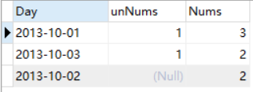

# MySQL 实战 - 复杂项目

## 作业

### 项目十：行程和用户（难度：困难）
Trips 表中存所有出租车的行程信息。每段行程有唯一键 Id，Client_Id 和 Driver_Id 是 Users 表中 Users_Id 的外键。Status 是枚举类型，枚举成员为 (‘completed’, ‘cancelled_by_driver’, ‘cancelled_by_client’)。
+----+-----------+-----------+---------+--------------------+----------+
| Id | Client_Id | Driver_Id | City_Id |        Status      |Request_at|
+----+-----------+-----------+---------+--------------------+----------+
| 1  |     1     |    10     |    1    |     completed      |2013-10-01|
| 2  |     2     |    11     |    1    | cancelled_by_driver|2013-10-01|
| 3  |     3     |    12     |    6    |     completed      |2013-10-01|
| 4  |     4     |    13     |    6    | cancelled_by_client|2013-10-01|
| 5  |     1     |    10     |    1    |     completed      |2013-10-02|
| 6  |     2     |    11     |    6    |     completed      |2013-10-02|
| 7  |     3     |    12     |    6    |     completed      |2013-10-02|
| 8  |     2     |    12     |    12   |     completed      |2013-10-03|
| 9  |     3     |    10     |    12   |     completed      |2013-10-03| 
| 10 |     4     |    13     |    12   | cancelled_by_driver|2013-10-03|
+----+-----------+-----------+---------+--------------------+----------+
Users 表存所有用户。每个用户有唯一键 Users_Id。Banned 表示这个用户是否被禁止，Role 则是一个表示（‘client’, ‘driver’, ‘partner’）的枚举类型。
+----------+--------+--------+
| Users_Id | Banned |  Role  |
+----------+--------+--------+
|    1     |   No   | client |
|    2     |   Yes  | client |
|    3     |   No   | client |
|    4     |   No   | client |
|    10    |   No   | driver |
|    11    |   No   | driver |
|    12    |   No   | driver |
|    13    |   No   | driver |
+----------+--------+--------+
写一段 SQL 语句查出 2013年10月1日 至 2013年10月3日 期间非禁止用户的取消率。基于上表，你的 SQL 语句应返回如下结果，取消率（Cancellation Rate）保留两位小数。
+------------+-------------------+
|     Day    | Cancellation Rate |
+------------+-------------------+
| 2013-10-01 |       0.33        |
| 2013-10-02 |       0.00        |
| 2013-10-03 |       0.50        |
+------------+-------------------+
赠送创建表格代码，开不开心，见附件   :-) 

```mysql
--初步计划，分组计算相除法
SELECT Request_at AS Day, ()/() FROM trips GROUP BY Day;
```

思路：将分开计算

查询非禁止用户取消的数量

```mysql
SELECT Request_at AS Day, COUNT(*) AS unNums
FROM trips  
WHERE Status = 'cancelled_by_driver'
GROUP BY Day
```

查询非禁止用户总体的数量

```mysql
SELECT Request_at AS Day,COUNT(*) AS unNums
FROM trips
WHERE Client_Id != (SELECT Users_id FROM users 
WHERE Role = 'client' AND Banned = 'Yes')
GROUP BY Request_at
```

设定为t1、t2两个表查询出数字结果

```mysql
SELECT t1.Day, t2.unNums,t1.Nums 
FROM (
SELECT Request_at AS Day,COUNT(*) AS Nums
FROM trips
WHERE Client_Id != (SELECT Users_id FROM users 
WHERE Role = 'client' AND Banned = 'Yes')
GROUP BY Request_at
) t1
LEFT JOIN (
SELECT Request_at AS Day, COUNT(*) AS unNums
FROM trips  
WHERE Status = 'cancelled_by_driver'
GROUP BY Day) t2
ON t1.Day = t2.Day
```



直接相除是存在空值的所以需要补零,并对日期排序

```mysql
SELECT t1.Day,
(CASE WHEN t2.unNums IS NULL THEN 0 ELSE t2.unNums END)/t1.Nums 
FROM (
SELECT Request_at AS Day,COUNT(*) AS Nums
FROM trips
WHERE Client_Id != (SELECT Users_id FROM users 
WHERE Role = 'client' AND Banned = 'Yes')
GROUP BY Request_at
) t1
LEFT JOIN (
SELECT Request_at AS Day, COUNT(*) AS unNums
FROM trips  
WHERE Status = 'cancelled_by_driver'
GROUP BY Day) t2
ON t1.Day = t2.Day
ORDER BY Day
```

### 项目十一：各部门前3高工资的员工（难度：中等）
将昨天employee表清空，重新插入以下数据（其实是多插入5,6两行）：
+----+-------+--------+--------------+
| Id | Name  | Salary | DepartmentId |
+----+-------+--------+--------------+
| 1  | Joe   | 70000  | 1            |
| 2  | Henry | 80000  | 2            |
| 3  | Sam   | 60000  | 2            |
| 4  | Max   | 90000  | 1            |
| 5  | Janet | 69000  | 1            |
| 6  | Randy | 85000  | 1            |
+----+-------+--------+--------------+
编写一个 SQL 查询，找出每个部门工资前三高的员工。例如，根据上述给定的表格，查询结果应返回：
+------------+----------+--------+
| Department | Employee | Salary |
+------------+----------+--------+
| IT         | Max      | 90000  |
| IT         | Randy    | 85000  |
| IT         | Joe      | 70000  |
| Sales      | Henry    | 80000  |
| Sales      | Sam      | 60000  |
+------------+----------+--------+
此外，请考虑实现各部门前N高工资的员工功能。

插入语句

```mysql
INSERT INTO employee
(Name, Salary, DepartmentId)
VALUES
('Janet',69000,1),
('Randy',85000,1)
```

```mysql
SELECT * 
FROM employee e2
WHERE EXISTS (
SELECT COUNT(*)
FROM employee e1
WHERE e2.Salary <= e1.Salary AND e1.DepartmentId = e2.DepartmentId
GROUP BY e1.DepartmentId HAVING COUNT(*) <= 3)


```

exists对外表用loop逐条查询，每次查询都会查看exists的条件语句，当 exists里的条件语句能够返回记录行时(无论记录行是的多少，只要能返回)，条件就为真，返回当前loop到的这条记录，反之如果exists里的条 件语句不能返回记录行，则当前loop到的这条记录被丢弃，exists的条件就像一个bool条件，当能返回结果集则为true，不能返回结果集则为 false

```mysql
SET @limit_n = 3;
SELECT
  d.NAME Department,
  e.NAME Employee,
  e.Salary
FROM
  Employee e
INNER JOIN Department d ON e.DepartmentId = d.Id
WHERE 
(
SELECT COUNT(1) FROM employee e2
WHERE e2.DepartmentId = d.Id AND e2.Salary > e.Salary
)<@limit_n;
```

### 项目十二  分数排名 - （难度：中等）
依然是昨天的分数表，实现排名功能，但是排名是非连续的，如下：
+-------+------+
| Score | Rank |
+-------+------+
| 4.00  | 1    |
| 4.00  | 1    |
| 3.85  | 3    |
| 3.65  | 4    |
| 3.65  | 4    |
| 3.50  | 6    |
+-------+------+

```mysql
SELECT Score, 
(SELECT COUNT(DISTINCT Score) FROM score WHERE Score >= S.Score)  
FROM score s ORDER BY Score DESC
```

